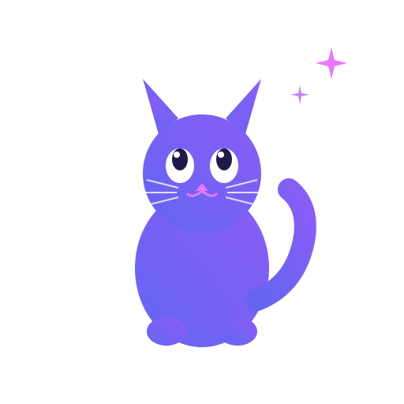

<p align="center">
  
</p>

<h1 align="center">CatsUp</h1>

<p align="center">
  <strong>Your AI-powered meeting assistant that runs locally</strong>
</p>

<p align="center">
  <a href="https://github.com/GeiserX/CatsUp/releases"></a>
  <a href="https://github.com/GeiserX/CatsUp/blob/main/LICENSE"></a>
  <a href="https://github.com/GeiserX/CatsUp/actions"></a>
</p>

---

**CatsUp** is a stealthy, cross-platform meeting assistant designed to run locally on your machine. It detects when you join a meeting, records the session, transcribes in real-time, and uses AI to generate summaries and answer questions about the discussion.

## Features

- **Stealth Mode** — Unobtrusive system tray/menu bar application
- **Cross-Platform** — Runs on Windows, macOS, and Linux
- **Meeting Detection** — Automatically detects Teams, Zoom, Slack, Google Meet
- **Smart Recording** — Captures video (window), system audio, and microphone
- **Real-Time Transcription** — Live speech-to-text with speaker detection
- **Screen Vision** — Understands what's on screen using OCR and vision AI models
- **Trigger Word Detection** — AI assistant activates when your name is spoken
- **AI-Powered Responses** — Contextual answers using OpenAI, Anthropic, Google, or local models
- **Live Mini Window** — Floating overlay with transcript, AI responses, quick actions
- **Private Options** — Use cloud APIs or 100% local processing with Ollama/llama.cpp

## Quick Start (macOS)

1. **Build**: Open `platform/macos/CatsUp.xcodeproj` in Xcode, build and run
2. **Configure**: Click menu bar icon → Settings → Add API keys
3. **Set Trigger Word**: Add your name (e.g., "Sergio") in Trigger Words tab
4. **Start**: Click "Start Detection" in menu bar dropdown
5. **Join Meeting**: CatsUp auto-detects and starts recording

## Architecture

CatsUp is built with a decoupled architecture to ensure cross-platform compatibility:

| Layer | Description |
|-------|-------------|
| **Core UI** | React + TypeScript + Vite |
| **Windows** | .NET 6 (WPF/WinForms) using WASAPI and Media Foundation |
| **macOS** | Swift (SwiftUI) using AVFoundation and ScreenCaptureKit |
| **Linux** | Python using Xlib/EWMH and FFmpeg |
| **AI Backend** | Cloud (OpenAI, Anthropic, Google) or Local (Whisper.cpp, Ollama, LLaVA) |

## Getting Started

### Prerequisites

- **Windows**: .NET 6 SDK
- **macOS**: Xcode 15+
- **Linux**: Python 3.10+, FFmpeg, Xlib
- **UI**: Node.js 20+

### Setup

```bash
# Clone the repository
git clone https://github.com/GeiserX/CatsUp.git
cd CatsUp

# Build the UI
cd ui
npm install
npm run build
```

### Run Platform Client

**Windows**:
```bash
cd platform/windows
dotnet run
```

**macOS**:
```bash
cd platform/macos
swift run
```

**Linux**:
```bash
cd platform/linux
python main.py
```

## Building for Release

The project includes GitHub Actions workflows for automated cross-platform builds.

| Platform | Command |
|----------|---------|
| Windows | `dotnet publish -c Release` |
| macOS | `swift build -c release` |
| Linux | `python -m PyInstaller` |

## AI Providers

CatsUp supports multiple AI providers for transcription, vision, and chat:

| Provider | Transcription | Vision | Chat |
|----------|--------------|--------|------|
| OpenAI | Whisper | GPT-4o | GPT-4o |
| Anthropic | — | Claude | Claude |
| Google | Speech-to-Text | Gemini | Gemini |
| Local | Whisper.cpp | LLaVA/Qwen-VL | Ollama |

## Contributing

Contributions are welcome! Please check out the `development` branch and read our contributing guidelines.

## License

This project is licensed under the **GNU General Public License v3.0** — see the [LICENSE](LICENSE) file for details.
